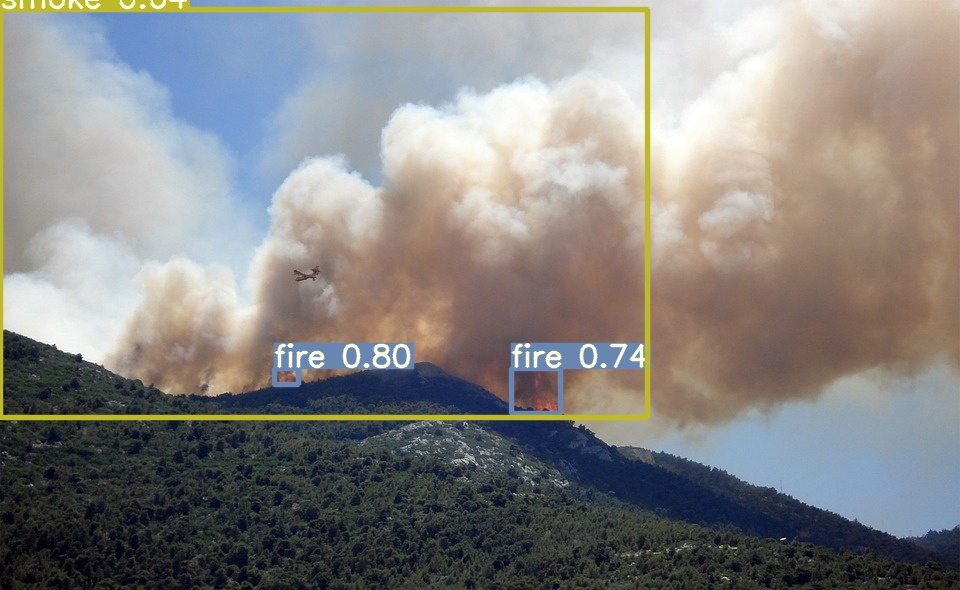
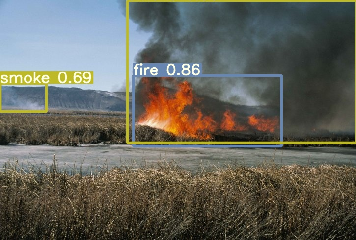
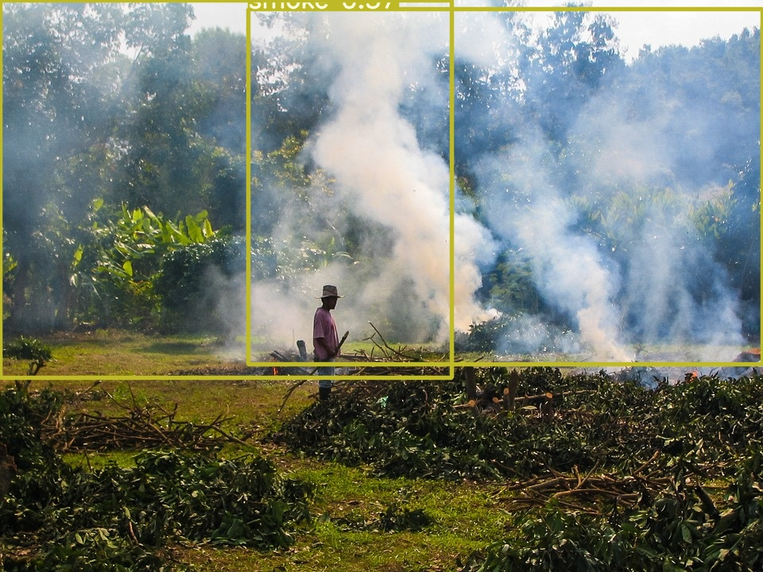
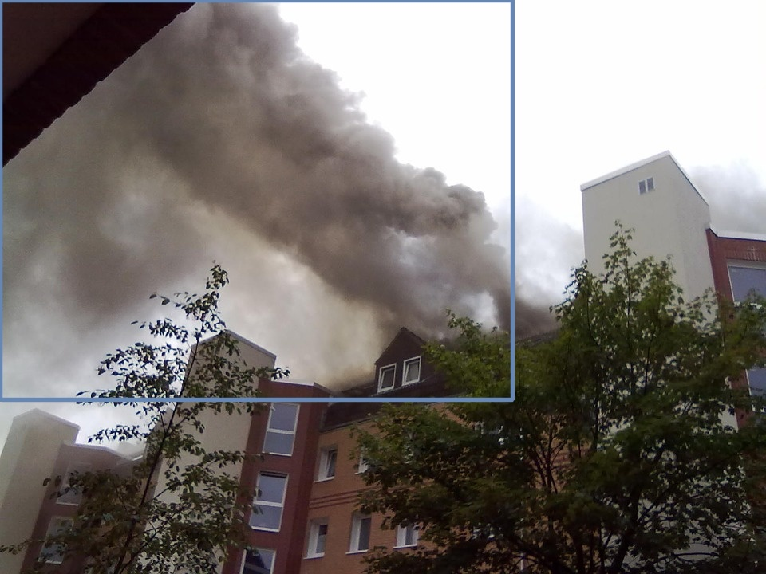
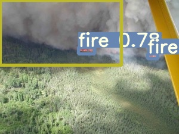
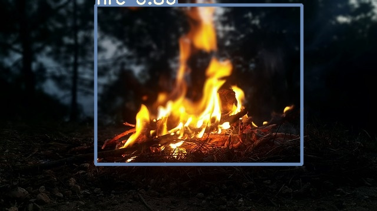

# PyTorch-YOLOv4-wildfire
Minimal implementation of YOLOv4 in PyTorch.

## Table of Contents
- [PyTorch-YOLOv4-wildfire](#pytorch-yolov4-wildfire)
  * [Table of Contents](#table-of-contents)
  * [Installation](#installation)
  * [Inference](#inference)
  * [Detect](#detect)
  * [Test](#test)
  * [Train](#train)
  * [Citation](#citation)
  * [Acknowledgements](#acknowledgements)


## THIS repo is forked from [WongKinYiu](https://github.com/WongKinYiu/PyTorch_YOLOv4)

## Installation
    $ git clone https://github.com/Wayne122/PyTorch-YOLOv4-wildfire.git
    $ cd PyTorch-YOLOv4-wildfire/
    $ sudo pip3 install -r requirements.txt

##### Download pretrained weights
if you just want a pretrained weights on wildfire dataset for test or detect, please download [pretrained weights file](https://drive.google.com/file/d/1xAtQ0FfEwuzDfZ7y8fiOI4BJ6kYYeZJY/view?usp=sharing), and put it into `weights` folder, the path:
`weights/yolov4-wildfire.pt`

## Inference
Uses pretrained weights to make predictions on images. `weights/wildfire_best.weights` was trained by wildfire data set.
`python3 detect.py --weights "weights/yolov4-wildfire.pt" --source "data/samples"`

<p align="center"></p>
<p align="center"></p>
<p align="center"></p>
<p align="center"></p>
<p align="center"></p>
<p align="center"></p>

## Detect

run`detect.py` to detect objects, and please  put samples into `data/samples`
defult weights files is `weights/yolov4-wildfire.pt`

## Test

run `test.py`

## Train
Data augmentation as well as additional training tricks remains to be implemented. PRs are welcomed!
```
    train.py [-h] [--epochs EPOCHS]
                [--batch_size BATCH_SIZE]
                [--cfg MODEL_CONFIG_PATH]
                [--data DATA_CONFIG_PATH]
                [--weights WEIGHTS_PATH]
                [--img_size IMG_SIZE]
```

## Citation

```
@article{bochkovskiy2020yolov4,
  title={{YOLOv4}: Optimal Speed and Accuracy of Object Detection},
  author={Bochkovskiy, Alexey and Wang, Chien-Yao and Liao, Hong-Yuan Mark},
  journal={arXiv preprint arXiv:2004.10934},
  year={2020}
}
```

```
@inproceedings{wang2020cspnet,
  title={{CSPNet}: A New Backbone That Can Enhance Learning Capability of {CNN}},
  author={Wang, Chien-Yao and Mark Liao, Hong-Yuan and Wu, Yueh-Hua and Chen, Ping-Yang and Hsieh, Jun-Wei and Yeh, I-Hau},
  booktitle={Proceedings of the IEEE/CVF Conference on Computer Vision and Pattern Recognition Workshops},
  pages={390--391},
  year={2020}
}
```

## Acknowledgements

* [https://github.com/AlexeyAB/darknet](https://github.com/AlexeyAB/darknet)
* [https://github.com/ultralytics/yolov3](https://github.com/ultralytics/yolov3)
* [https://github.com/ultralytics/yolov5](https://github.com/ultralytics/yolov5)
